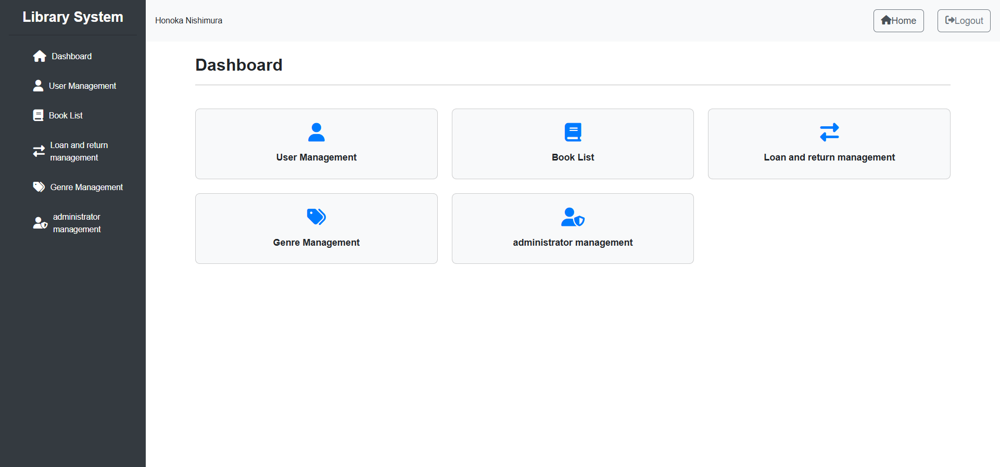
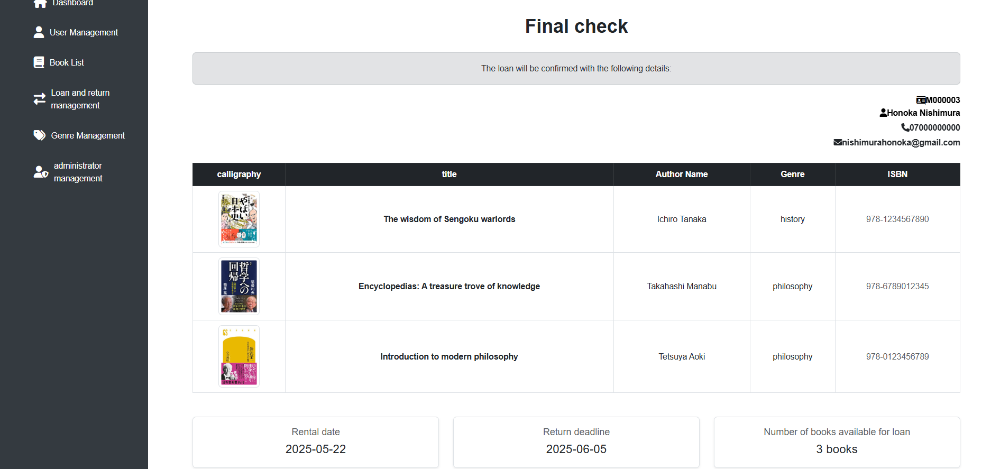
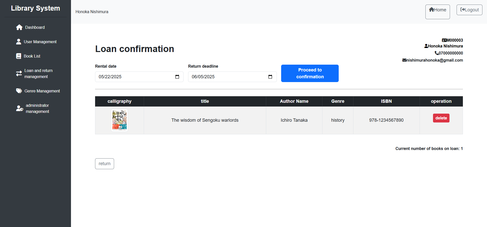
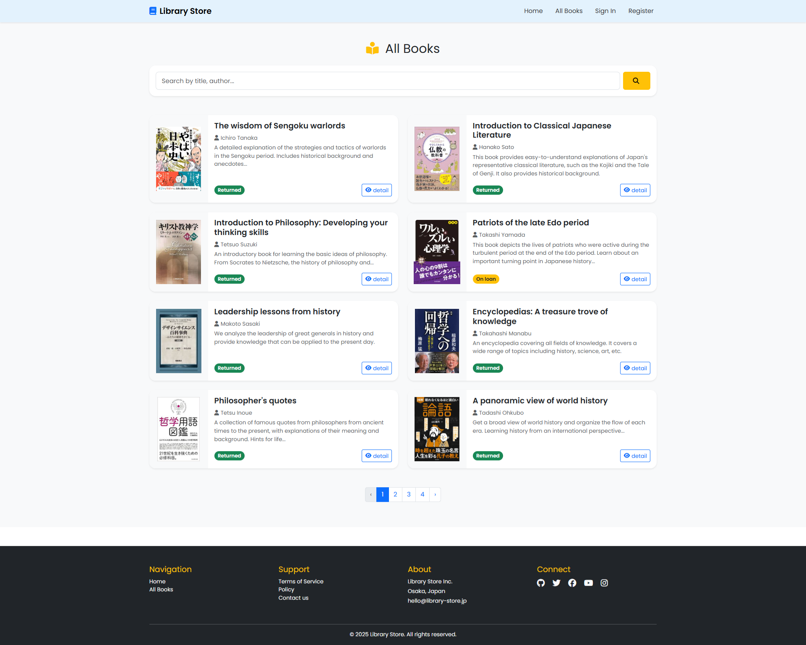
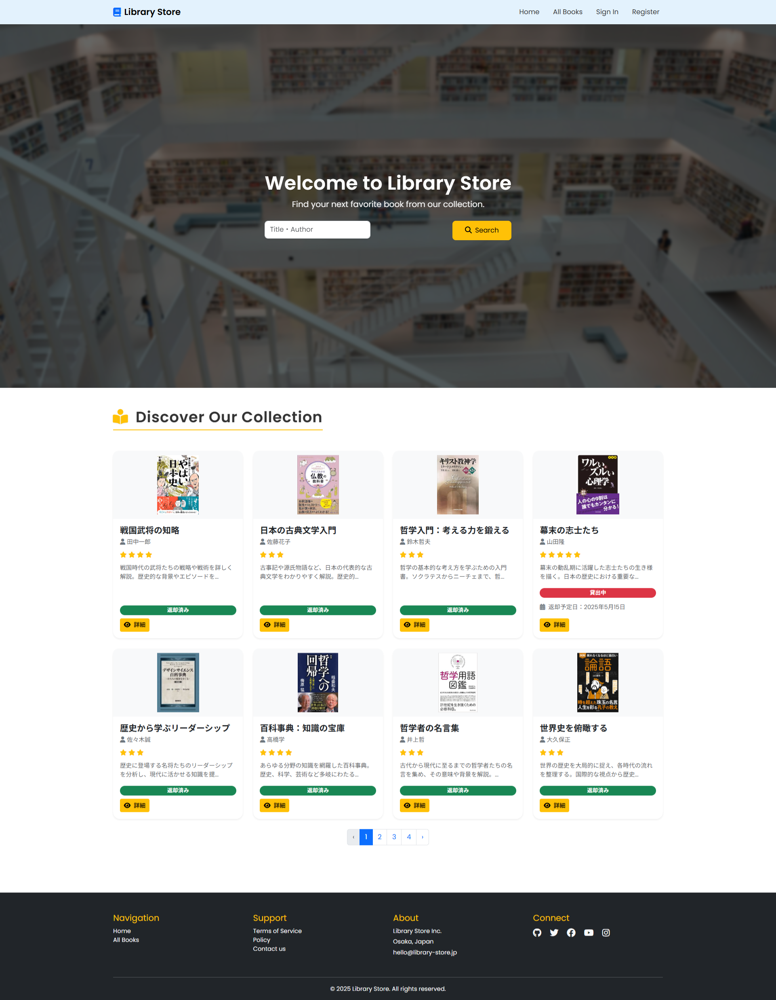
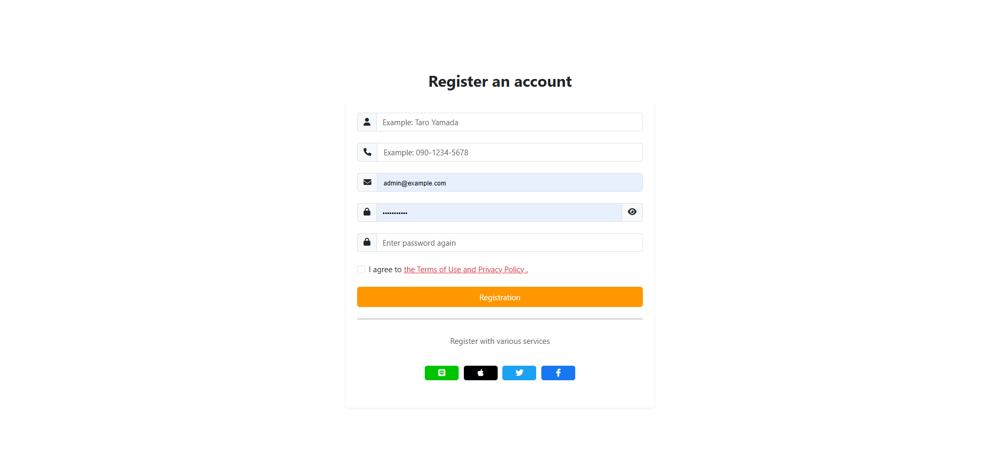

# Livni

A fully functional library management system built with Laravel.  
This project simulates a real-world administrative system where all operations are tightly integrated with backend data logic.


---

## Features

- User registration with auto-assigned member number
- Admin panel with role-based access
- Book CRUD management (add, edit, delete)
- Genre/category system
- Loan and return management with due dates
- Real-time loan status tracking
- All operations are automatically reflected in the database

---

## Project Overview

- **Framework**: Laravel 10
- **Language**: PHP 8.x
- **Database**: MySQL (phpMyAdmin during development)
- **Frontend**: Blade templating + Bootstrap/CSS
- **Architecture**: MVC (Model-View-Controller)
- **Hosting**: Compatible with Cloudflare Pages for frontend display

---


## Screenshots

### Dashboard (Admin Panel)


### Final Loan Check Page


### Loan Confirmation


### All Books (User View)


### Home Page (User Side)


### Registration Page


---

## How to Run Locally

```bash
git clone https://github.com/honokanishimura/library-app.git
cd library-app

cp .env.example .env
php artisan key:generate

# If using SQLite:
touch database/database.sqlite

php artisan migrate
php artisan serve
